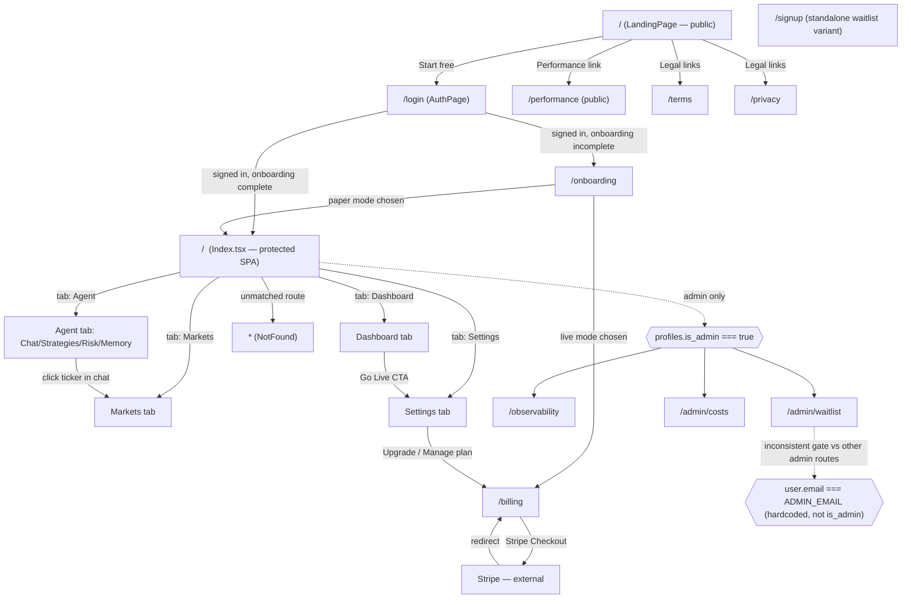

# Omii AI-PM TradeAgent — Design Report

Reverse-documented from the running codebase (branch `test/full-system-production-readiness`, 2026-07-30) as the eval target for a full-system production-readiness functional test suite. This is the first time this system's behavior has been written down end-to-end — treat gaps found here as real findings, not omissions in the writing.

## 1. Summary & Capabilities

TradeAgent is an AI-operated trading agent for Kalshi prediction markets, sold as a SaaS. A user connects a Kalshi account and an LLM provider key, the platform seeds three template strategies (surface arbitrage, longshot-bias, weather-edge), and a deterministic cron pipeline scans markets, generates signals, gates entries through an LLM qualify/reject step, executes orders (paper-simulated or live), settles outcomes, and reflects lessons back into per-user and (eventually) platform-shared agent memory. Users interact through a dashboard (positions, P&L, strategy leaderboard), a chat-first agent panel (manual trades, strategy/risk configuration), a public markets browser, and a public performance page intended as the track-record artifact for fundraising.

Two audiences: paying users (paper or live trading, Stripe-billed) and Onofre as admin (an internal observability dashboard for incident triage, cost tracking, and waitlist management).

**Headline capabilities:**
- Autonomous trading pipeline: signal generation → LLM-gated qualification → order execution → settlement → memory reflection, running on pg_cron with no external scheduler.
- Three live strategies: S-001 (surface arbitrage, no LLM gate — structural violation only), S-002 (longshot-bias, LLM-gated), S-005 (weather-edge, LLM-gated above a threshold).
- Server-side risk enforcement: daily loss/drawdown caps, position size/count limits, kill switch, tier-based entitlement gating.
- Paper and live trading modes, with live gated behind a paid Stripe subscription and an explicit onboarding risk acknowledgment.
- Public performance page as the track-record artifact (see CLAUDE.md — this unlocks family capital).
- Admin observability dashboard: 12-detector failure-mode grid, connection health, execution traces, cost tracking.
- Community knowledge-sharing layer (platform-shared agent memory): **not started** — confirmed zero references to `is_platform_shared` anywhere in the codebase during this audit.

## 2. Feature Inventory

Feature IDs are stable and never renumbered. Frontend user-facing features are `F1`–`F122`. Backend/system features (edge functions, the majority of which have no UI surface) are `EF1`–`EF32`, grouped by domain. Shared logic modules that back multiple edge functions are referenced inline, not given their own IDs — they are implementation detail, not a feature.

### 2.1 Frontend — Public marketing & legal

| ID | Feature | User story | Acceptance criterion | Priority | Status |
|----|---------|------------|----------------------|----------|--------|
| F1 | Live hero mockup | As a visitor I see real platform stats in the hero so I trust the product is live | On mount, fetch `platform-stats`; if `totalPnl` is numeric, render ROI/win-rate/status; on fetch failure show "Live performance data temporarily unavailable" | MVP | shipped |
| F2 | Waitlist signup | As a visitor I can join the waitlist | Valid email POSTs to `waitlist-signup`; on `ok`, form replaced with confirmation + live count | MVP | shipped |
| F3 | Waitlist count display | As a visitor I see demand | `count("id")` on `waitlist` renders next to the form | Secondary | shipped |
| F4 | FAQ accordion | As a visitor I get quick answers | Clicking a question toggles it; only one open at a time | Secondary | shipped |
| F5 | Mobile nav menu | As a mobile visitor I can navigate | Hamburger toggles full-screen overlay with anchors + sign-in CTA | Secondary | shipped |
| F6 | Pricing tier display | As a visitor I compare plans | 3 tier cards render; Free CTA → `/login`, paid CTAs → `#waitlist` | MVP | shipped |
| F7 | Section nav links | As a visitor I jump to a section | Nav link scroll-anchors to matching `#id` | Secondary | shipped |
| F8 | Standalone waitlist page (`/signup`) | As a visitor I join the beta waitlist | Direct insert into `waitlist` (not via edge function); `23505` unique-violation treated as success | Secondary | **needs decision** — likely superseded by F2, confirm route should still exist |
| F105 | Terms of Service | Static legal content | 12 sections incl. risk disclosure, $10 liability cap if unpaid, fund custody | MVP | shipped |
| F106 | Privacy Policy | Static legal content | Documents community knowledge-sharing opt-in default, 30-day data-deletion SLA | MVP | shipped |
| F107 | 404 page | Unmatched route | Logs attempted path to console; "Return to Home" link | Secondary | shipped |

### 2.2 Frontend — Auth (`/login`)

| ID | Feature | Acceptance criterion | Priority | Status |
|----|---------|----------------------|----------|--------|
| F9 | Email/password sign-in | Valid credentials → `signInWithPassword` → `window.location.replace(returnTo)`; invalid → inline error, form persists | MVP | shipped |
| F10 | Email/password sign-up | Submitting in signup mode calls `signUp`; success shows "Check your email…", flips to login mode | MVP | shipped |
| F11 | Google OAuth | Click calls `signInWithOAuth({provider:"google"})` with `redirectTo` = origin + `returnTo` | MVP | shipped |
| F12 | Login/signup mode toggle | Toggle flips `mode`, clears error/message | Secondary | shipped |
| F13 | Password visibility toggle | Eye icon toggles input `type` between `password`/`text` | Secondary | shipped |
| F14 | `?return=` deep-link preservation | `returnTo` read from query string, used for OAuth `redirectTo` and post-login `replace` | MVP | shipped |

### 2.3 Frontend — Onboarding wizard (`/onboarding`, 7 steps)

| ID | Feature | Acceptance criterion | Priority | Status |
|----|---------|----------------------|----------|--------|
| F15 | Already-onboarded redirect guard | If `profiles.onboarding_completed`, `navigate("/")` fires on mount | MVP | shipped |
| F16 | Welcome step | Static step 1; "Get started" advances to `name` | Secondary | shipped |
| F17 | Display name entry | Save upserts `profiles.display_name`; "Skip" advances without saving | Secondary | shipped |
| F18 | AI provider key connection | Save POSTs `save-ai-key`; success also upserts a per-provider default model; "Skip" advances | MVP | shipped |
| F19 | Kalshi account connection + test | "Save & Test" POSTs `save-kalshi-key` then `kalshi-ping`; success shows balance; failure shows specific inline error; "Skip" advances without a key | MVP | shipped |
| F20 | Risk acknowledgment (4 checkboxes) | "I agree — continue" disabled until all 4 checked | MVP | shipped |
| F21 | Mode selection → strategy + risk seeding | Paper: upserts `onboarding_completed=true, trading_mode="paper"`, seeds S-001 (active)/S-002 (inactive)/S-005 (active) + paper+live `risk_settings`, advances to confirmation. Live: same seeding with `trading_mode="live"`, navigates to `/billing` | MVP | shipped |
| F22 | "Agent is live" confirmation | Step 7 lists S-001/S-005; "Go to dashboard" navigates to `/` | Secondary | shipped |

### 2.4 Frontend — App shell & Dashboard (`/`, protected SPA)

| ID | Feature | Acceptance criterion | Priority | Status |
|----|---------|----------------------|----------|--------|
| F23 | Tab navigation | Clicking a nav item updates `activeTab`; all tab content stays mounted (CSS-hidden), state survives switching | MVP | shipped |
| F24 | Paper/Live toggle with upgrade gate | Free tier + not admin → upgrade modal instead of switching; paid/admin → `profiles.trading_mode` persists immediately | MVP | shipped |
| F25 | Upgrade modal | "View plans" → `/billing`; "Stay on paper" closes modal | Secondary | shipped |
| F26 | Live-mode safety banner | Renders once per session (`sessionStorage` guard) for ~9.35s when `mode==="live"` | MVP | shipped |
| F27 | Sign-out (mobile dropdown) | Click calls `supabase.auth.signOut()` | MVP | shipped |
| F28 | Portfolio value + return hero | Headline shows `totalReturnPct` (color-coded) + dollar value; "--"/"loading…" while loading | MVP | shipped |
| F29 | Live Kalshi wallet balance | `kalshi-ping` throttled 1×/15s; its `balance_usd` becomes displayed value; ping failure retains last known-good balance (never falls to $0) | MVP | shipped |
| F30 | Today's P&L badge | Pill shows ▲/▼ "Up/Down $X today" only when `todayPnl !== 0` and not loading | MVP | shipped |
| F31 | Win-streak badge | Renders only when streak ≥2 (most recent settled day is today/yesterday) | Secondary | shipped |
| F32 | Equity sparkline | Renders once ≥3 daily points exist, from settled P&L since 2026-04-22 | MVP | shipped |
| F33 | Quick stats grid | 4 tiles: Win Rate / Settled / Open / Today's trades; "--" while loading | MVP | shipped |
| F34 | Dynamic single CTA | Exactly one of: "Go Live" (paper) / "N positions settling today" / "View latest trade" / none | Secondary | shipped |
| F35 | Agent heartbeat badge | Polls `compliance_log` every 2min for latest `auto_trade_run`/`auto_trade_skipped`; "Active" (pulsing) if ≤240min, else "Stale" | MVP | shipped |
| F36 | Status chips (last settled / settling today / scanning) | Each renders conditionally per state | Secondary | shipped |
| F37 | Rotating strategy insight strip | Auto-advances every 4s through S-001/002/003/005; prefers latest `agent_memory` lesson → win-rate stat → hardcoded copy; renders nothing if user has none of the 4 template strategies | Secondary | shipped |
| F38 | Multi-strategy equity overlay chart | One line per active strategy (mode-filtered), hidden if ≤1 data point | MVP | shipped |
| F39 | Strategy leaderboard | Rows sorted descending by ROI; empty state when none active | MVP | shipped |
| F40 | Open positions list + expand + cancel | Click expands detail; live mode with resting order → "Cancel resting order" calls `cancelKalshiOrder`, toasts, refetches | MVP | shipped |
| F41 | Trade log + rate trade (thumbs up/down) | Newest 50 trades render; thumbs click updates `trades.user_rating`, inserts `agent_memory` row (`source_type:"user_feedback"`); same rating again clears it | MVP | shipped |

### 2.5 Frontend — Agent tab (Chat / Strategies / Risk / Memory)

| ID | Feature | Acceptance criterion | Priority | Status |
|----|---------|----------------------|----------|--------|
| F42 | Chat send/stream | Post to `trading-agent`; response streams token-by-token | MVP | shipped |
| F43 | Quick-prompt chips | Click immediately sends preset text | Secondary | shipped |
| F44 | AI model selector (persisted) | Selection upserts `api_keys` (`provider="model_agent"`), persists across sessions | MVP | shipped |
| F45 | Reload model list | Click re-fetches `list-ai-models`; falls back silently to `FALLBACK_MODELS` | Secondary | shipped |
| F46 | Creativity (temperature) slider | 0–1 step 0.05, sent as `temperature` on next chat call | Secondary | shipped |
| F47 | Per-strategy max position size | Blur/Enter upserts `strategy_config.max_position_usd`; values <1 or non-numeric ignored | MVP | shipped |
| F48 | System prompt editor | Edited text sent as `systemPrompt` on next chat call | Secondary | shipped |
| F49 | Conversation persistence | On mount, restores up to 50 prior `chat_messages` from `localStorage` conversation id | MVP | shipped |
| F50 | Clickable market tickers in chat | `KX...` token renders as button; click calls `onOpenMarket(ticker)`, switches to Markets, opens detail modal | MVP | shipped |
| F51 | Strategy list + count | List filters to `s.mode === mode`; "N strategies · M active" | MVP | shipped |
| F52 | Create strategy | Filling name/description/instructions/balance + Create inserts a row; disabled while name blank | MVP | shipped |
| F53 | Enable/disable strategy toggle | Switch click updates `strategies.active` immediately | MVP | shipped |
| F54 | Edit strategy | Save updates name/description/instructions/starting_balance | MVP | shipped |
| F55 | Delete strategy | Click deletes immediately | MVP | **bug** — no confirmation dialog on an irreversible action; see §6 |
| F56 | Strategy detail modal + equity chart | Modal shows Balance/P&L/ROI/Win Rate + line chart + trade count + instructions | MVP | shipped |
| F57 | "Test in Paper" clone | Available only when a live strategy's template has no existing paper instance; inserts a paper-mode clone | Secondary | shipped |
| F58 | Legacy/unattributed trades summary | Renders only if `strategyStats["_unattributed"].totalTrades > 0` | Secondary | shipped |
| F59 | Global kill switch | Toggle upserts `risk_state` (`is_trading_halted`, `halt_reason`) for today+user; unauthenticated attempt blocked with error toast | MVP | shipped |
| F60 | Agent capital limit + budget allocation sliders | Save writes `risk_settings.allocated_capital` and per-strategy `strategies.starting_balance = round(totalBudget × pct/100)`; warns if allocations don't sum to 100% | MVP | shipped |
| F61 | Max Daily Loss/Drawdown/Position Size/Open Positions/Daily Trades sliders | Save upserts matching `risk_settings` columns for `user_id`+`mode` | MVP | shipped |
| F62 | Auto stop-loss toggle + % | Save persists `risk_settings.auto_stop_loss` + `stop_loss_pct` | MVP | shipped |
| F63 | Default order type selector | Save persists `risk_settings.default_order_type` | Secondary | shipped |
| F64 | Agent memory feed | Up to 50 active `agent_memory` rows, newest-first, confidence bars; "Show N more" beyond 5 | MVP | shipped |

### 2.6 Frontend — Markets tab

| ID | Feature | Acceptance criterion | Priority | Status |
|----|---------|----------------------|----------|--------|
| F65 | Category tabs (12) | Clicking a tab re-filters/fetches to that category | MVP | shipped |
| F66 | Sort selector | Grid re-orders on selection (Volume / 24h Volume / Closing Soon) | Secondary | shipped |
| F67 | Timeframe filter | Only markets closing within chosen window render | Secondary | shipped |
| F68 | Search | Case-insensitive substring match on question text/ticker, live | MVP | shipped |
| F69 | Manual refresh + freshness indicator | Refresh bypasses TTL cache; pulsing "Live" + timestamp | Secondary | shipped |
| F70 | Signal/open-position pills on cards | Card shows YES/NO signal pill (<2h old) or "Open" pill (unsettled filled trade) | MVP | shipped |
| F71 | Quick Yes/No trade from card | Click opens TradeModal pre-set to that side | MVP | shipped |
| F72 | Market detail modal | Click (not on trade button) opens modal; "View on Kalshi" deep-links out | MVP | shipped |
| F73 | Pagination | "Show N more" increases visible count by 50 | Secondary | shipped |
| F74 | Deep-link market open (from chat) | `openMarketTicker` prop triggers fetch + opens detail modal, then clears | Secondary | shipped |
| F75 | Manual trade placement | Submit POSTs `execute-trade` with side/price/amount/mode/strategyId; success toasts + closes; failure shows inline error, modal stays open | MVP | shipped |
| F76 | Trade side/amount/price controls | Side click resets price to that side's ask; amount via quick-picks [5,10,20,50] or typed (1–500); price via slider (1–99) with live max-win recalc | MVP | shipped |
| F77 | Optional strategy assignment on manual trade | Dropdown of active strategies | Secondary | **bug** — not filtered by trade mode; see §6 |
| F78 | Mode-aware risk disclosure in TradeModal | "Paper" vs "Live — real money" badge + "$X at risk" always shown pre-submit | MVP | shipped |

### 2.7 Frontend — Settings tab

| ID | Feature | Acceptance criterion | Priority | Status |
|----|---------|----------------------|----------|--------|
| F79 | Avatar upload + crop | Selecting an image opens crop modal; confirm uploads cropped blob to Storage, updates `profiles.avatar_url` (cache-busted) | Secondary | shipped |
| F80 | Edit display name | Save updates `profiles.display_name` | MVP | shipped |
| F81 | Plan status + upgrade link | Free/inactive → "Upgrade" → `/billing`; paid/active → "Manage" | MVP | shipped |
| F82 | AI provider connection status | Green check if any `api_keys` row exists for a known provider | MVP | shipped |
| F83 | Kalshi connection status | Green check if `api_keys` has a `kalshi_live` row | MVP | shipped |
| F84 | Default AI model picker | Select + "Set as Default" deletes then re-inserts the `model_agent` `api_keys` row | MVP | shipped |
| F85 | Save AI provider keys | POSTs `save-ai-key` with bearer auth; success flips badge to "Configured"; missing session/failure shows "Save failed" | MVP | shipped |
| F86 | Save Kalshi live keys | POSTs `save-kalshi-key`; disabled until both Key ID + private key filled; specific error inline on failure | MVP | shipped |
| F87 | Notification preferences | Channel + per-event toggles write to `profiles.notification_prefs` immediately (no save button) | Secondary | shipped |
| F88 | Save phone number | Save/Enter updates `profiles.phone`; success/error state shown 3s | Secondary | shipped |
| F89 | Sign out (Settings) | Click calls `supabase.auth.signOut()` | MVP | shipped |

### 2.8 Frontend — Performance page (`/performance`, public)

| ID | Feature | Acceptance criterion | Priority | Status |
|----|---------|----------------------|----------|--------|
| F90 | Public track record dashboard | Fetches current user's own paper trades if signed in | MVP | **needs decision** — `fetchAll()` scopes to `auth.getUser()`, so an anonymous visitor sees an empty state, not platform-wide data; verify this is intended for a page meant as the fundraising track-record artifact |
| F91 | Era selector | Selecting an era filters all stats/charts by `created_at` cutoff | Secondary | shipped |
| F92 | Equity curve hero chart | Area chart from settled-trade daily aggregates; "No settled trades yet" when <2 points | MVP | shipped |
| F93 | Stat cards | P&L, Win Rate, Trades, Days Running, Avg Win/Loss, Profit Factor, Max Drawdown; "--" when denominator is 0 | MVP | shipped |
| F94 | Daily P&L bar + distribution histogram | Renders only when sufficient data exists | Secondary | shipped |
| F95 | Open positions list | Ticker-parsed settlement date, max potential win/loss; "Show all N" beyond 6 | MVP | shipped |
| F96 | Per-strategy/per-category breakdown | Rows sorted by P&L descending; win-rate bar per category | MVP | shipped |
| F97 | Recent settlements list | Resolution badge + P&L; empty state when none | Secondary | shipped |
| F98 | Share to X | Pre-filled tweet intent with current P&L/win-rate/trade-count | Secondary | shipped |
| F99 | Auto-refresh | 60s poll + Supabase realtime channel on `trades` both trigger `load()` | Secondary | shipped |

### 2.9 Frontend — Billing (`/billing`)

| ID | Feature | Acceptance criterion | Priority | Status |
|----|---------|----------------------|----------|--------|
| F100 | Current plan display | Shows tier + "Active" when status is active/trialing | MVP | shipped |
| F101 | Upgrade to paid tier | POSTs `create-checkout` with bearer auth + `{tier}`; redirects to Stripe Checkout on success; inline error on failure | MVP | shipped |
| F102 | Manage subscription | POSTs `manage-billing`; redirects to returned portal URL | MVP | shipped |
| F103 | "Upgraded" confirmation banner | Shows when `?upgraded=1` query param present | Secondary | shipped |
| F104 | Unauthenticated guard | No session → `navigate("/")` | MVP | shipped |

### 2.10 Frontend — Admin (Observability, Waitlist, Cost Report)

| ID | Feature | Acceptance criterion | Priority | Status |
|----|---------|----------------------|----------|--------|
| F108 | Platform View / per-user switcher | Admin selects aggregated or per-user view; downstream queries re-scope | MVP | shipped |
| F109 | 12-card failure-mode grid + 24h timeline | Cards show ✖/▲/● per detector (llm_timeout, kalshi_timeout, rate_limit, exchange_error, strategy_error, pii_detected, db_connection, network_failure, memory_pressure, execution_gap, +2 more); click opens detail + resolution guidance | MVP | shipped |
| F110 | Agent heartbeat/execution-gap detector | Silence >120min since last `auto_trade_run`/`auto_trade_skipped` flagged; links to time-scoped logs | MVP | shipped |
| F111 | Connection health grid (6 providers) | Green/yellow/red dot by 24h error-count thresholds | MVP | shipped |
| F112 | Errors/guardrail panel | Deduplicated groups of risk/position/suspension events; "Clean" when empty | MVP | shipped |
| F113 | System pills (mode/model/function count) | Live-vs-paper visibility at a glance | MVP | shipped |
| F114 | "Run compact-memory" button | POSTs `compact-memory` edge function | MVP | **bug** — failure silently swallowed (`.catch(()=>{})`), no admin feedback; see §6 |
| F115 | Execution traces | Day picker, expand/collapse, pagination within a 90s window | Secondary | shipped |
| F116 | Decision History table | Filtered `trades` table with per-row detail modal | Secondary | shipped |
| F117 | Agent Memory admin panel | Type filter, sort, quarantine view, expand | Secondary | shipped |
| F118 | Cost & Efficiency section | LLM spend, token stats, billing registry, monthly infra estimate | Secondary | shipped |
| F119 | Waitlist table view (`/admin/waitlist`) | Lists all signups via `waitlist-admin` | MVP | **needs decision** — gated by hardcoded `ADMIN_EMAIL`, not `is_admin`, inconsistent with `/admin/costs`; see §6 |
| F120 | Export waitlist CSV | Click downloads `waitlist-<date>.csv` via `?format=csv` | Secondary | shipped |
| F121 | Manual refresh (waitlist) | Re-fetches list | Secondary | shipped |
| F122 | Live cost report dashboard (`/admin/costs`) | Live user/trade/waitlist counts, cost breakdown, invocation table vs free tier, scaling projections | Secondary | shipped |

### 2.11 Backend — Trading pipeline: signal generation

| ID | Function | Trigger | Acceptance criterion | Test coverage | Stakes |
|----|----------|---------|----------------------|----------------|--------|
| EF1 | `signal-generator` | pg_cron `:08`/15min + LLM tool call | Given `yes_bid=45/yes_ask=55, last_price=54` (divergence ≥3¢), emits `direction:"buy_yes"`, `signals.edge_cents=round(edge_score*10)`, `source="signal_generator"` | none | indirect |
| EF2 | `surface-scanner` | pg_cron `:03` + LLM tool call | Given 3+ non-threshold markets in one `event_ticker` summing to <85¢, inserts `surface_alerts` row `alert_type="bracket_sum_violation"` | none | indirect — insert is fire-and-forget, not awaited |
| EF3 | `futures-signal` | pg_cron (schedule unverified vs live `cron.job`) | Given KXFED mid=42¢ vs computed futures prob divergence ≥12¢, inserts `signals` row `source="futures_oracle"` | none | none — never trades, writes signals only |
| EF4 | `weather-signal` | pg_cron `4,14,24,34,44,54 * * * *` (re-registered 2026-07-30 — see §6 #17, was completely deregistered) | Given calibrated edge ≥25¢, writes `signals` row `source="weather_signal_s005"` | partial (math helpers only) | none — writes signals only |
| EF5 | `backtest` | HTTP only, no cron found | `?mode=trade_performance&strategy=S-002&days=30` returns `trade_count` matching exact settled-row count | none | none — read-only |
| EF6 | `backtest-weather` | pg_cron `backtest-weather-daily` — **registration unverified against live `cron.job`** | Given ≥3 days mean error ≥2.5°F, `weather_calibration.bias_fahrenheit` set; if `\|bias\|≥1.0`, inserts `agent_memory` row | none | none |

### 2.12 Backend — Trading pipeline: execution (highest stakes in the system)

| ID | Function | Trigger | Acceptance criterion | Test coverage | Stakes |
|----|----------|---------|----------------------|----------------|--------|
| EF7 | `auto-trade` | pg_cron, **live-verified** `*/5 * * * *` | Given active/unhalted strategy + fresh qualifying signal + no lock held, one POST fires to `execute-trade`, `signals.was_acted_on`/`surface_alerts.is_exploited` flips exactly once | helper functions only — zero on HTTP handler, lock mechanism, risk-gate sequencing | indirect (orchestrates real trades) |
| EF8 | `trading-agent` | HTTP, sole caller is AgentPanel | Given a live-mode cancel request, correct Kalshi `DELETE /portfolio/orders/{id}` fires and order status updates | none | **HIGH-STAKES** — does not import `risk.ts`/`limits.ts`/`prompt-safety.ts`; paper-mode manual trades bypass server-side risk enforcement |
| EF9 | `execute-trade` | HTTP, called by `auto-trade`/`execute-basket`/`trading-agent` | Given live mode, `POST /portfolio/events/orders` fires with correct ticker/side/price/qty; response maps to `order_id`/`avg_price`/`status` | none | **HIGH-STAKES** — zero idempotency (no `client_order_id`, no unique constraint on `trades.order_id`); rate limiter fails open on DB error |
| EF10 | `execute-basket` | HTTP, only live caller is `trading-agent`'s tool (auto-trade's S-001 routing comment is stale/false) | Given a leg failure after fills, `flattenFilledLegs()` runs and `baskets.status` reflects actual flatten success | `supabase/functions/tests/integration/execute-basket.integration.test.ts` (5 tests) | **HIGH-STAKES, was completely non-functional for every real user until 2026-07-31 — see §6 finding #18** |

### 2.13 Backend — Trading pipeline: settlement & reconciliation

| ID | Function | Trigger | Acceptance criterion | Test coverage | Stakes |
|----|----------|---------|----------------------|----------------|--------|
| EF11 | `auto-settle` | pg_cron `2,12,22,32,42,52 * * * *` | Given resolved market + matching filled/unsettled trade, `status→'settled'`, `pnl`/`net_pnl` match `computePnl()` | logic-only (`trading-logic.test.ts`) | **HIGH-STAKES** — confirmed bug: void/refund path sets `pnl=0` but never sets `net_pnl`, leaving it stale/null |
| EF12 | `settle-signals` | pg_cron `*/15 * * * *` | Given resolved market, `shadow_pnl` computed correctly for buy_yes/buy_no | none | moderate — corrupts the LLM-gate feedback loop that governs real trades |
| EF13 | `reconcile-orders` | pg_cron `1-59/5 * * * *` | Given `remaining_count_fp='0.00'`, trade advances to `filled` with correct `filled_price`/fees | logic-only | **HIGH-STAKES** — no Telegram alert on fatal crash (only `compliance_log`); silent capital-stranding risk |
| EF14 | `paper-reconcile` | pg_cron `2-59/5 * * * *` | Given orderbook simulation fills ≥ requested, trade advances to `filled` | logic-only | moderate — guards the track-record artifact's integrity |

**Known incident pattern in this domain:** `reconcile-orders-cron`, `paper-reconcile-cron`, and `settle-signals-cron` have each had silent multi-day registration gaps in production (settle-signals never ran once, leaving 20,936/21,782 signals unsettled until a 2026-07-25/28 health-check catch). Functional tests for EF11–EF14 must assert the cron job is actually registered in `cron.job`, not just that the function's internal logic is correct — "logic correct but never runs" is the dominant real-world failure mode here.

### 2.14 Backend — Risk & billing enforcement

| ID | Function | Trigger | Acceptance criterion | Test coverage | Stakes |
|----|----------|---------|----------------------|----------------|--------|
| EF15 | `create-checkout` | HTTP, JWT required | Valid JWT + tier → 200 with `checkout.stripe.com` URL, `subscriptions` row upserted | none | **HIGH-STAKES** (money) |
| EF16 | `manage-billing` | HTTP, JWT required | Existing `stripe_customer_id` → 200 with `billing.stripe.com` URL; none → 404 | none | **HIGH-STAKES** |
| EF17 | `stripe-webhook` | Stripe webhook, HMAC-verified | Valid `checkout.session.completed` → `subscriptions` upserted active; invalid signature → 401, no write; duplicate `event.id` → no second state change | `verifyStripeSignature` unit-tested; handler untested | **HIGH-STAKES** |
| EF18 | `switch-trading-mode` | HTTP, dual auth (JWT or service-role) | Given active sub + saved `kalshi_live` key + no pending HITL, flips `profiles.trading_mode`, updates strategies, logs `compliance_log` | none — untracked in git prior to this audit | **HIGH-STAKES, highest in domain** — the paper→live on-ramp |

**Correction to CLAUDE.md:** "No subscription enforcement in edge functions" (Build Status → In progress) is stale. `checkEntitlement` is actively called from `execute-trade`, `auto-trade`, and `switch-trading-mode`. Update CLAUDE.md's Build Status section to reflect this — enforcement exists, what's missing is the billing UI and full test coverage of the enforcement path.

### 2.15 Backend — Agent memory & learning loop

| ID | Function | Trigger | Acceptance criterion | Test coverage | Stakes |
|----|----------|---------|----------------------|----------------|--------|
| EF19 | `auto-reflect` | pg_cron, 15min | Given settled trade `pnl` with abs value ≥10 within a 6h window, exactly one `trade_lessons` row + one new/updated `agent_memory` row created | none | indirect — feeds the qualify prompt gating real trades; two prior production incidents originated here (frozen-30-trades bug, mode-crossing false-suspension) |
| EF20 | `compact-memory` | Called by `auto-reflect` (30min cooldown) + directly callable | Given 3 active memories sharing type/strategy/tag, produces one merged row, `merged_into` set on originals | none | indirect — merge can silently drop numeric trading conditions the system prompt explicitly warns against |

**Confirmed not started:** `is_platform_shared` / platform-memory-promotion — zero references anywhere in the codebase. Matches CLAUDE.md's "Not started" list; no correction needed there.

**Architectural gap:** `_shared/tool-gateway.ts` — the typed external-call wrapper this project's own Agent Systems standard (`STANDARDS.md`) requires for every external call from agent code — has zero callers anywhere in the codebase. Fully dead code, contradicting the standard this repo is supposed to meet.

### 2.16 Backend — Market data & external integrations

| ID | Function | Trigger | Acceptance criterion | Test coverage | Stakes |
|----|----------|---------|----------------------|----------------|--------|
| EF21 | `kalshi-proxy` | HTTP from frontend | Valid credential + `GET portfolio/balance` → 200 passthrough; no credential → 401 | none | **HIGH-STAKES, confirmed bug** — no endpoint/method allowlist; can place/cancel live orders via `POST`/`PUT ?endpoint=portfolio/orders`, not read-only despite its use as a general proxy |
| EF22 | `kalshi-ping` | HTTP, onboarding | Valid key → `{ok:true, balance_usd}`; bad key → `{ok:false, error}` | none | none — read-only |
| EF23 | `market-data-fetcher` | pg_cron, every 5min | Healthy run upserts all 18 series; 3 consecutive failures → abort + critical log + Telegram alert | none | none directly — but every trading function in §2.11–2.13 depends on this cache being fresh |

### 2.17 Backend — User account / key management

| ID | Function | Trigger | Acceptance criterion | Test coverage | Stakes |
|----|----------|---------|----------------------|----------------|--------|
| EF24 | `save-ai-key` | HTTP, JWT | Valid provider+key → `api_keys` row with `secret_ciphertext`/`secret_iv` set, `encrypted_secret=null` | none | **HIGH-STAKES (security), confirmed bug** — `list-ai-models` reads only `encrypted_secret`, never `secret_ciphertext`/`secret_iv`; any key saved here is structurally invisible to `list-ai-models` |
| EF25 | `save-kalshi-key` | HTTP, JWT | Valid key pair → `ok:true`, encrypted row written | none | **HIGH-STAKES, confirmed gap** — no live validation against Kalshi; a garbage key pair is accepted and stored with `ok:true` |
| EF26 | `list-ai-models` | HTTP | No keys anywhere → 400; valid key → filtered/deduped model list | none | **confirmed gap** — no auth check at all; reads `api_keys` with no `user_id` filter (cross-tenant leak potential) |
| EF27 | `waitlist-signup` | HTTP, public | Valid email → `ok:true` + row written; duplicate → still `ok:true`; invalid → 400, no write | none | none |

**Correction to CLAUDE.md:** "legacy plaintext fallback retained for zero-downtime" is attributed to `encryption.ts`, but the fallback actually lives in the callers (`kalshi-auth.ts`, `auto-trade`, `trading-agent`), which are untested. `encryption.ts` itself has no plaintext path and is well unit-tested (14 cases).

**Confirmed zero coverage on the multi-tenancy boundary:** `_shared/tenant.ts` — the sole enforcement point for tenant isolation once service-role bypasses RLS — has zero test coverage, and includes a documented "legacy single-tenant NULL fallback" still valid in production. This is a single point of failure for every other function's isolation and should be one of the first functional tests written.

### 2.18 Backend — Admin / observability / health

| ID | Function | Trigger | Acceptance criterion | Test coverage | Stakes |
|----|----------|---------|----------------------|----------------|--------|
| EF28 | `health-check` | pg_cron | Two concurrent identical alerts → exactly one `compliance_log` row via `claim_health_check_alert` advisory-lock dedup; second call within cooldown skipped | none | not money-moving, but is the entire detection layer — multiple past incidents where it silently failed to alert |
| EF29 | `platform-stats` | HTTP, public, no auth | Settled trades for hardcoded `CANONICAL_USER_ID` since 2026-04-22 → correct `totalPnl`/`winRate`/`dailyCumulative` | none | none — but single-account despite the "platform" name; `startingBalance` silently falls back to `2500` if none found |
| EF30 | `waitlist-admin` | HTTP, JWT required | **confirmed gap** — any authenticated user (not just admins) gets 200 + full waitlist; no server-side admin/role check, gating is client-side only | none | security gap, low blast radius (emails only) |

### 2.19 Backend — Notifications

| ID | Function | Trigger | Acceptance criterion | Test coverage | Stakes |
|----|----------|---------|----------------------|----------------|--------|
| EF31 | `telegram-webhook` | Telegram webhook POST | Valid secret + allowlisted chat_id + `/status` → correct reply; `/run trade` → invokes `auto-trade` | none | **HIGH-STAKES, confirmed bug** — secret check fails open: if `TELEGRAM_WEBHOOK_SECRET` is unset, the check is skipped entirely |
| EF32 | `daily-digest` | pg_cron (schedule set via management API only, not in repo) | User with 3 settled trades → exactly one email/SMS + one `compliance_log` row; 0 trades → no send | none | none — informational only |

## 3. User Workflows

### 3.1 New user signup → paper trading live
1. Visitor lands on `/` → clicks "Start free" → `/login`.
2. Toggles to "Create account" → email/password → submit → confirmation email sent, screen shows "Check your email…". *Edge case:* signup with an already-used email surfaces Supabase's error inline.
3. User confirms email, signs in → redirected per `?return=` or to `/`.
4. Auth gate detects `onboarding_completed=false` → redirects to `/onboarding`.
5. Welcome → display name (or skip) → AI provider key (or skip) → Kalshi key + test (or skip) → all 4 risk acknowledgments → choose "Paper Trading".
6. `finishOnboarding` seeds S-001/S-002/S-005 + paper/live `risk_settings`, sets `onboarding_completed=true`, advances to confirmation.
7. "Go to dashboard" → `/` (Dashboard tab, paper mode). *Edge case (network failure mid-finish):* toast "Setup failed", step doesn't advance, no partial state left inconsistent — all writes happen before navigation.

### 3.2 Existing user — daily check-in
1. Sign in → Dashboard tab.
2. Reviews return %, today's P&L, equity sparkline, agent heartbeat badge.
3. Agent tab → Chat → asks a question, gets streamed reply, clicks a ticker mention → jumps to Markets with that market's detail modal open.
4. Markets tab → filters by category → "Buy Yes" on a card → TradeModal pre-set → adjusts amount/price → submits → success toast, modal closes, trade appears in the log on next poll/realtime tick.
5. *Edge case:* submit fails (e.g. server-side risk limit exceeded) → inline error in modal, modal stays open, no trade recorded.

### 3.3 Upgrading to live trading
1. Dashboard paper/live toggle → free tier, not admin → upgrade modal.
2. "View plans" → `/billing` → selects Starter → Stripe Checkout redirect.
3. Completes payment externally → Stripe redirects to `/billing?upgraded=1` → confirmation banner.
4. Returns to `/` → toggles Live → mode persists → `LiveModeBanner` shows once per session.
5. *Edge case:* user abandons Checkout → returns to `/billing` with no `?upgraded=1` → plan still shows prior tier, no false-positive confirmation.

### 3.4 Configuring risk before going live
1. Agent tab → Risk sub-tab.
2. Sets Agent Capital Limit + per-strategy budget allocation → warned if allocations don't sum to 100% → saves.
3. Sets Max Daily Loss, Max Drawdown, Max Position Size, Max Open Positions, Max Daily Trades → saves.
4. Enables Auto Stop-Loss at a chosen %.
5. If something looks wrong mid-day, clicks "Pause All Trading" → `risk_state.is_trading_halted=true`, confirmed by success toast.
6. *Edge case:* save fails (DB error) → button shows "Save failed," no silent false-success.

### 3.5 Manual strategy management
1. Agent tab → Strategies → "Create" → fills name/description/instructions/balance → appears in list (paper mode default, inactive).
2. Toggles active → agent evaluates it on next scan cycle.
3. Clicks card → detail modal with equity chart + stats.
4. "Edit Strategy" from detail modal → pre-filled dialog → saves changes.
5. Deletes a strategy → **deletion is immediate, no confirmation step** (F55 bug — a functional test here should assert current behavior only after the fix decision in §6 is made, not encode the bug as spec).

### 3.6 Admin incident triage
1. Admin signs in, passes `AdminRoute`'s `is_admin` check, opens `/observability`.
2. Scans the 12-card failure-mode grid → sees `execution_gap` in critical state.
3. Clicks card → modal shows detected silence window + "Open logs" link scoped to that time.
4. Cross-checks Connection Health grid → Kalshi provider red with recent 429s → confirms root cause is exchange rate limiting, not the agent.
5. Checks System Health pills → confirms trading mode and active model as expected.
6. If memory quarantine volume looks abnormal, clicks "Run compact-memory" → **if the underlying fetch throws, no error is surfaced** (F114 bug).

### 3.7 Autonomous trading cycle (system workflow, no user action)
1. `market-data-fetcher` refreshes the Kalshi cache every 5min; 3 consecutive failures abort with a critical alert.
2. `signal-generator`/`surface-scanner`/`futures-signal`/`weather-signal` write candidate signals/alerts on their own cadences.
3. `auto-trade` (every 5min, live-verified) loads active unhalted strategies, applies the risk pre-check, routes S-001 (no LLM gate) vs S-002/S-005 (LLM qualify/reject), and calls `execute-trade` on a qualifying opportunity.
4. `execute-trade` places the order (paper-simulated or live HMAC-signed Kalshi call) and writes the trade row.
5. `reconcile-orders`/`paper-reconcile` advance resting orders to filled every 5min.
6. `auto-settle` resolves outcomes against settled Kalshi markets every 10min, computing realized P&L and triggering the daily-loss halt if breached.
7. `auto-reflect` (hourly) synthesizes settled trades into `trade_lessons` and `agent_memory`, feeding back into the next cycle's qualify prompt.
8. `health-check` watches all of the above for silence, error spikes, and duplicate positions, alerting via Telegram/`compliance_log`.

## 4. UI Flow & States

**Route → auth requirement:**

| Route | Auth gate | Notes |
|-------|-----------|-------|
| `/` | Session required; also gates on `onboarding_completed` | Shows LandingPage when signed out |
| `/login` | Public | — |
| `/signup` | Public | Alternate/legacy waitlist page, not linked from primary nav |
| `/performance` | Public route, data scoped to `auth.getUser()` internally | Anonymous visitor likely sees empty state — F90 needs decision |
| `/terms`, `/privacy` | Public | Static |
| `/onboarding` | No route-level guard; page self-redirects if already onboarded | — |
| `/billing` | No route-level guard; page self-redirects to `/` if unauthenticated | — |
| `/observability` | `AdminRoute` (`is_admin`) | — |
| `/admin/waitlist` | `AdminRoute` (`is_admin`) **plus** an internal hardcoded-email check inside the component — double gate, inconsistent with `/admin/costs` | F119 needs decision |
| `/admin/costs` | `AdminRoute` (`is_admin`) only | — |
| `*` | Public | 404 |

Within `/` (Index.tsx SPA): navigation is state-based (`activeTab`), not route-based — Dashboard/Agent/Markets/Settings never get their own URL, and all four stay mounted simultaneously (CSS-hidden) to avoid re-fetching on tab switch. Playwright tests must assert on tab-content visibility, not `page.url()`.

**Orphaned components (built, unreachable — not imported from any route):** `CompliancePanel.tsx`, `AccountStatusCard.tsx`, `AppHeader.tsx`, `PortfolioChart.tsx`, `NavLink.tsx`. Mirrors the existing Polymarket dead-code situation. Excluded from the functional suite below (no route renders them, nothing to test) — needs a keep/wire-up/delete decision, see §6.

## 5. Traceability

Format: Feature/Function ID → Test file → What's covered. Filled in incrementally as the functional suite lands — most of the 154 IDs in §2 still have zero dedicated coverage; this section is the honest record of what actually changed in this pass, not a claim of full coverage.

| ID | Test file | Covers |
|----|-----------|--------|
| — (cross-cutting: tenant isolation boundary for every user-scoped edge function) | `supabase/functions/_shared/tenant.test.ts` | `resolveTenant` JWT/body/legacy resolution order, `applyTenantFilter`, `tenantInsertFields`, `getRiskSettings`/`getRiskStateToday` mode+tenant scoping and fail-closed error handling, `setRiskHalt` update-vs-insert branching. 21 tests. |
| EF21 `kalshi-proxy` | `supabase/functions/_shared/kalshi-proxy-logic.test.ts` | The new endpoint/method allowlist (finding #1) — every allowed GET prefix, the single-order-cancel-only DELETE rule, and that POST/PUT are rejected on every endpoint including ones GET permits. 21 tests. |
| EF10 `execute-basket` | `supabase/functions/_shared/basket-logic.test.ts` (16 tests) + `supabase/functions/tests/integration/execute-basket.integration.test.ts` (5 tests, live) | `determineBasketStatus`'s branches, `resolveFlattenOutcome`'s cases, the new `didLegFill` fix (finding #19), and live end-to-end: happy path, leg validation, dead-ticker leg not counted as filled/not flattened, live-mode capital cap rejection. |
| EF9 `execute-trade` | `supabase/functions/tests/integration/execute-trade.integration.test.ts` (10 tests, live) | Happy-path paper fill, risk-limit rejection, nonexistent-ticker behavior (documents finding #18's residual gap), missing-field/invalid-side/invalid-action/price-bounds validation, missing auth, negative-amount gap. |
| — (cross-cutting: real orderbook parsing, backs every paper fill + live liquidity check) | `supabase/functions/_shared/kalshi-market-data.test.ts` | `parseKalshiOrderbook` against a real captured API response — finding #18 regression lock. 8 tests. |
| EF11 `auto-settle` | `supabase/functions/tests/integration/auto-settle.integration.test.ts` (4 tests, live) | Smoke test, WIN/LOSS pnl against a real finalized Kalshi market with hand-verified expected values (confirms the net_pnl void-path fix produces a non-null value on the settle path too), idempotency. No new bugs found. |
| EF14 `paper-reconcile` | `supabase/functions/tests/integration/paper-reconcile.integration.test.ts` (4 tests, live) | Smoke test, advances a resting order when the real book now crosses the requested price (second live consumer of the orderbook-parsing fix — initially failed until the function itself was redeployed, see note below), stays open on an unrealistic price, idempotency. |
| EF18 `switch-trading-mode` | `supabase/functions/tests/integration/switch-trading-mode.integration.test.ts` (4 tests, live) | Invalid mode, no-auth rejection, subscription-required gate blocking live (confirms trading_mode never flips on rejection), clean paper-mode switch. No bugs found — gates hold. Never exercises an actual live flip. |
| EF13 `reconcile-orders` | `supabase/functions/tests/integration/reconcile-orders.integration.test.ts` (1 test, live) | Smoke only — exclusively processes live resting orders, out of scope for deeper testing without real live order placement (demo-Kalshi-environment decision below). |
| F55 (strategy delete) | none yet — UI change only, no automated test | Confirmation dialog now blocks the delete until explicit confirm; needs a Playwright spec against an authenticated session (see gap below). |
| F77 (TradeModal mode scoping) | none yet — UI change only | Strategy dropdown now filters `.eq("mode", mode)`; needs a Playwright spec against an authenticated session. |
| F114 (compact-memory error surfacing) | none yet — UI change only | Failed POST now toasts an error instead of swallowing it; needs a Playwright spec against an authenticated admin session. |

**Deploy-process note:** `supabase functions deploy <name>` bundles each function's own copy of shared code at deploy time — fixing `kalshi-market-data.ts` didn't propagate to `paper-reconcile` until it was individually redeployed (confirmed by a live test that failed with the exact pre-fix symptom — zero fill despite provable real depth — until redeployed). Any future shared-module fix must redeploy every importing function, not just the one being directly tested; `grep -rl "<module>" supabase/functions/*/index.ts` finds them.

**Rate limiting note:** running the full integration suite back-to-back in one pass can trip execute-trade's own 15/min paper rate limit (expected, correct behavior — not a bug) since execute-trade, execute-basket, and paper-reconcile all place real paper trades on the same test account. A future CI wiring (Phase 2) should account for this — either accept occasional single-test flakiness on a full run, or space the suite across the run.

**Coverage gap, stated plainly:** the remaining ~146 feature IDs (every onboarding step, most trading-UI flows, billing, admin observability, most authenticated user journeys) have no functional test yet. A dedicated E2E test account now exists (`qa+e2e@kalshitradeagent.com`, paper mode, deactivated strategies so the live cron never touches it — see `supabase/functions/tests/integration/helpers.ts`) and backs all six integration-test files above; a second admin account exists for future admin-surface coverage. Still needed for full UI coverage: a Playwright auth fixture (Phase 2 of the follow-up plan), CI secrets wiring these credentials into `.github/workflows/ci.yml`, and — for live-mode order-placement coverage specifically — a decision on wiring Kalshi's demo-environment (`external-api.demo.kalshi.co`) into the app, plus Stripe test-mode keys for billing coverage. Existing `tests/e2e/*.spec.ts` still cover only the unauthenticated/public surface. Findings prioritized over broad new test authoring because they were live bugs, not just coverage gaps — see the CLAUDE.md `execution` section on separating "planned" from "tested."

## 6. Known Issues Found During This Audit

Found while reverse-documenting, not introduced by this document. Listed here for a fix-or-encode-as-spec decision before their acceptance criteria are locked as test targets — writing a test against a bug without deciding first just certifies the bug.

| # | Finding | Feature/Function | Severity |
|---|---------|-------------------|----------|
| 1 | No endpoint/method allowlist — authenticated passthrough can place/cancel live Kalshi orders | EF21 `kalshi-proxy` | HIGH-STAKES |
| 2 | Secret check fails open if `TELEGRAM_WEBHOOK_SECRET` is unset — `/run trade` reachable without the intended gate | EF31 `telegram-webhook` | HIGH-STAKES |
| 3 | `finalStatus="flattened"` set without verifying any flatten attempt succeeded — can mask naked live exposure | EF10 `execute-basket` | HIGH-STAKES |
| 4 | Void/refund settlement path never sets `net_pnl`, leaving it stale/null | EF11 `auto-settle` | HIGH-STAKES |
| 5 | No `user_id` filter when reading `api_keys` — cross-tenant key leak potential; also no auth check at all | EF26 `list-ai-models` | HIGH-STAKES (security) |
| 6 | Keys saved via `save-ai-key` are written to columns `list-ai-models` never reads — saved keys are structurally invisible | EF24/EF26 | correctness |
| 7 | No live validation against Kalshi — a garbage key pair is accepted and stored with `ok:true` | EF25 `save-kalshi-key` | correctness |
| 8 | Any authenticated user (not just admins) can read the full waitlist — gating is client-side only | EF30 `waitlist-admin` | security |
| 9 | `tenant.ts` (sole multi-tenancy enforcement point once service-role bypasses RLS) has zero test coverage | cross-cutting | HIGH-STAKES |
| 10 | Strategy delete has no confirmation dialog — immediate, irreversible | F55 | correctness/UX |
| 11 | Manual-trade strategy dropdown isn't scoped to the trade's mode — a paper trade could get tagged with a live-mode strategy | F77 | correctness |
| 12 | "Run compact-memory" failure is silently swallowed (`.catch(()=>{})`) — no admin feedback | F114 | correctness |
| 13 | `/admin/waitlist` gated by hardcoded `ADMIN_EMAIL` instead of `is_admin`, inconsistent with `/admin/costs` | F119 | consistency |
| 14 | `tool-gateway.ts` (required by this project's own Agent Systems standard) has zero callers — dead code contradicting the standard | cross-cutting | architecture |
| 15 | `reconcile-orders`, `paper-reconcile`, `settle-signals` crons have each had silent multi-day registration gaps historically | EF11–EF14 | process |
| 16 | 5 orphaned components built but unreachable from any route | §4 | cleanup |
| 17 | `weather-signal-cron` had no row in `cron.job` at all (not stale — never registered), confirmed by a live query on 2026-07-30. S-005 is seeded active for every onboarded user but was structurally starved of new signals. Also absent from `expected_cron_jobs`, so the "job never registered" watchdog couldn't have caught it. **Fixed same day**: re-registered on its intended staggered schedule (`4,14,24,34,44,54 * * * *`, migration `20260730_reregister_weather_signal_cron.sql`); `weather-signal-cron`, `paper-reconcile-cron`, and `settle-signals-cron` all added to the manifest | EF4 | HIGH-STAKES (fixed) |
| 18 | `fetchOrderbook` cast Kalshi's raw orderbook response directly to the internal `Orderbook` type with zero transformation. The real API has no top-level `yes`/`no` keys — everything lives under `orderbook_fp.{yes,no}_dollars` — so `orderbook.yes`/`.no` were `undefined` for every real request, meaning every paper-trade fill simulation and every live pre-trade liquidity check has been walking an empty book regardless of actual market depth, since this code was written. Never caught because `fill-sim.test.ts`'s fixtures hand-construct the correct internal shape directly rather than parsing a real API response. **Fixed same day**: `parseKalshiOrderbook()` added to `kalshi-market-data.ts`, verified against a live captured response and Kalshi's own docs, deployed and validated with 10 passing integration tests | EF9 | HIGH-STAKES (fixed) |
| 19 | `execute-basket` counted any `legResult.success === true` as "this leg filled," including a `success:true` response with an unfilled `status:"open"` trade (the same root cause as #18/finding-adjacent — execute-trade doesn't hard-reject a no-liquidity/nonexistent-ticker leg). This let a basket report `"completed"` when a leg never actually filled, and could make `flattenFilledLegs` submit a closing order against a position that never existed. **Fixed same day**: new `didLegFill()` helper requires `trade.status` to be `filled`/`partial`, gating both basket-completion counting and which legs get flattened | EF10 | HIGH-STAKES (fixed) |
| 20 | The `baskets` table has **no `user_id` column at all** — confirmed via `information_schema` — and was never included in `20260403000000_multi_tenancy.sql`'s rollout. Since `execute-basket` always calls `tenantInsertFields(tenant.userId)`, every basket-creation insert for any real authenticated user has been rejected by PostgREST with a schema-cache error, a 500 on every single call. **execute-basket has been completely non-functional for every real user** since tenant-scoping was added to it — only ever exercised (if at all) via the legacy NULL-tenant path. Also had RLS enabled with zero policies (any direct user-JWT read would return nothing regardless). **Fixed same day**: migration `20260731_baskets_multi_tenancy.sql` adds the column, index, and `baskets_user_isolation` RLS policy matching every other table's pattern; verified live with passing integration tests | EF10 | HIGH-STAKES (fixed) |

## Revisions
- v1 · 2026-07-30 · Initial reverse-documentation from running codebase, ahead of the full-system production-readiness test suite.
- v2 · 2026-07-31 · First backend integration-test batch (execute-trade, execute-basket) surfaced and fixed 3 more HIGH-STAKES findings (#18–#20): a real-orderbook-parsing bug that made every paper fill simulate against an empty book, a basket fill-tracking bug that could mark a basket "completed" or attempt to flatten a leg that never filled, and `baskets` missing its `user_id` column entirely — execute-basket had been completely non-functional for every real authenticated user.
